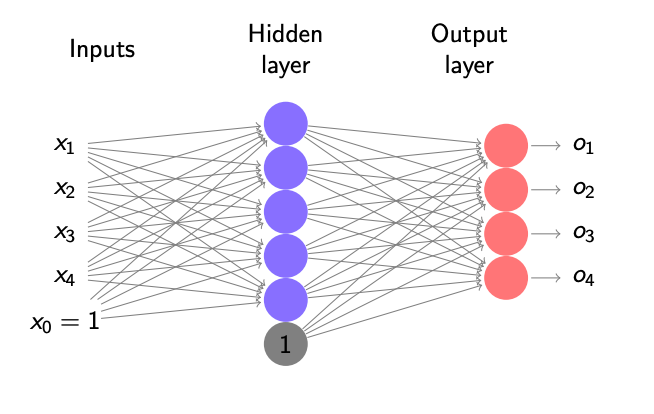

# Neural Networks
##### Date: $4^{th}$ march

**Reminder:** Programming Assignment Due Friday

#

##### Give Quiz NN
Allows model to have more flexibility

**Why note work with a thresholded perceptron?**
$\rightarrow$ Not differentiable

Gradient: Implement Multiperceptron Python.

**Programming Assignment 2:** Real World Problem and use Neural Network.

$$ w_1.x_1 + w_2.x_2 + w_3.x_3... = w^Tx \rightarrow y$$ 

stack units, all similar to each other. $ \rightarrow $ layer

Each can get many inputs, but one output (For now)

stack layers to create an architecture.
One output layer.
If Regression - one output
If Classification - number of classes output

**1. Number of units in a layer $\rightarrow$ width of the layer**

Just having linear units is not enough, we want to have non-linearity.

So change our unit. Instead of linear unit, we use a non-linear unit. 

$$ w_1.x_1 + w_2.x_2 + w_3.x_3... = w^Tx \rightarrow y
\sum x_i.w_i \rightarrow activation function (f)
$$ 

**Activation Function**

**1. Sigmoid Function**

$$ f(z) = \frac{1}{1 + \exp(-z)}$$

**2. tanh unit:**

$$ f(z) = \frac{\exp(z) - \exp(-z)}{\exp(z) + \exp(-z)}  $$

**3. RELU Unit: Rectified Linear Unit**

$$ f(z) = max(0,z) $$

Different layers can have different activation functions.

#

### Multi-Layered Perceptron (MLP) - K-way classification

$x \in R^4$

Input Layer   |   Hidden Layer   |   Output Layer

Lets say you have trained neural network

Every layer, every unit gets a bias. (Bias Signal)

**Bias Term:** *Reason different from regression. It could happen our inputs might not be enough to produce an output.*

Other end n outputs

One of those outputs will be highest.

**Note: These outputs will not sum up to one. Caliberate the output to probabilities by normalization and softmax**

Let $x \in R^2$

$z_1 = \sigma(w_1^{(1)T}.x)$

$o_1 = w_1^{(1)T}.\left(\begin{array}{c} 
z_1\\ 
z_2\\
1
\end{array}\right)
$

**Activation 
Output of a unit**

**Note:** Neural networks are called as universal approximator.

#

Dimensionality
**Turn off some layers**

Effect of having too many layers.

### How do we train a network?

Take some X $(x_1, x_2 ...)$
**Gradient Descent**

Error is computed after output layer. Relate that error downstream weights.
1. First calculate error at output
2. Use that to calculate GD back. **(Back Propagation)**

compute $W_T.x \rightarrow Y$

Some $x \rightarrow \left(\begin{array}{c} 
1\\ 
x_1\\
x_2\\
x_3\\
\end{array}\right)$

Intialize the weight vector:

$$ L(w) = \frac{1}{2}. (y - w^T.x)^2$$ 

$$ \frac{d}{d w_0}L(w) = -2(y-w^Tx)$$

$$ \frac{d}{d w_1}L(w) = -2(y-w^Tx).x_1$$

New weight:

$$ w_0 = w_0 - \mu \frac{d}{dw_0} L(w)$$
$$ w_0 = w_0 - \mu (-(y-w^T.x))$$
$$ w_1 = w_1 - \mu (-(y-w^T.x).x_1)$$

In MLP, at each unit, find error using back propagation and multiply it with output...

#